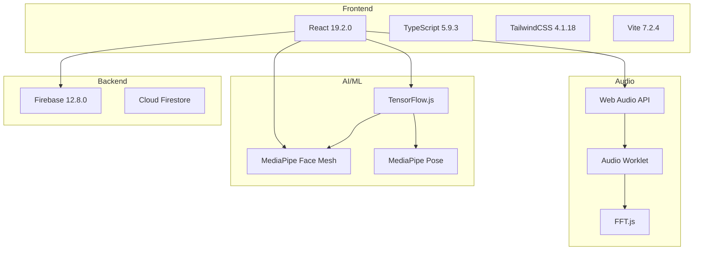
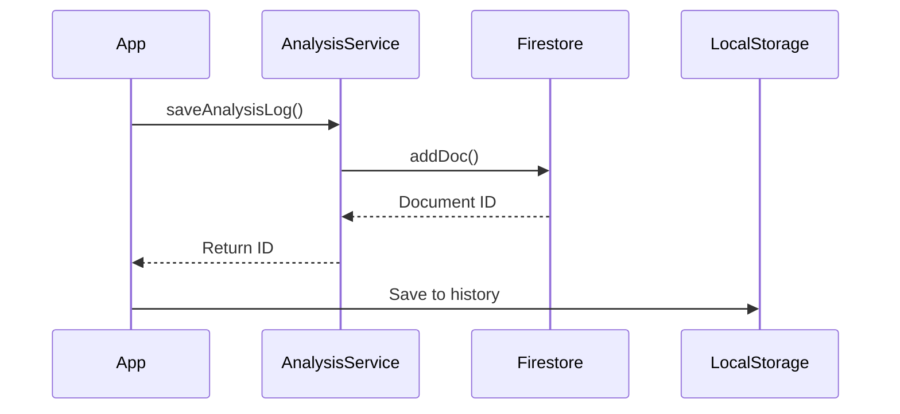
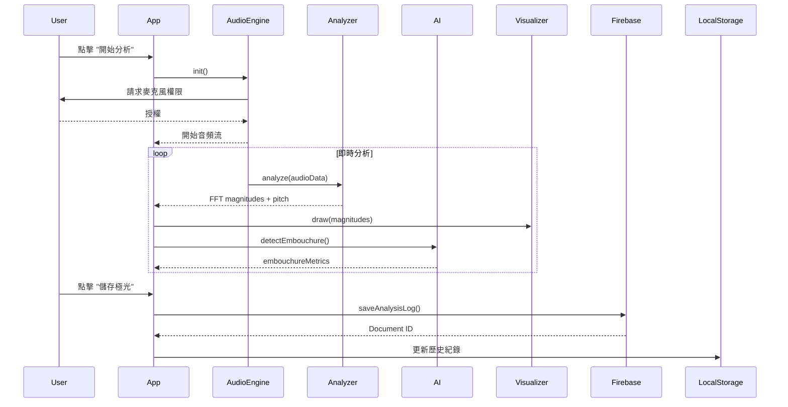
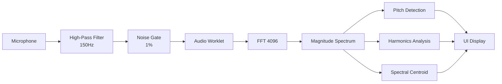

# Aurora - 音樂訓練分析系統規格書
**版本**: 1.0.0  
**專案名稱**: AeroFlute (Aurora)  
**最後更新**: 2026-02-05

---

## 📋 目錄

1. [系統概述](#系統概述)
2. [技術架構](#技術架構)
3. [核心功能模組](#核心功能模組)
4. [資料庫設計](#資料庫設計)
5. [API 規格](#api-規格)
6. [系統流程](#系統流程)
7. [樂器配置系統](#樂器配置系統)
8. [效能要求](#效能要求)

---

## 🎯 系統概述

### 專案簡介

Aurora 是一個進階的音樂訓練分析系統,專為管樂器學習者設計。系統整合了即時音訊分析、AI 姿勢檢測和視覺化回饋，提供全方位的練習輔助。

### 核心特色

- **即時音頻分析**: FFT 頻譜分析、泛音檢測、音準偵測
- **AI 姿勢監測**: MediaPipe 人臉網格、嘴型分析、肩膀姿勢檢測
- **多樂器支援**: 聲樂、長笛、直笛、薩克斯風等 8 種樂器
- **智慧噪音抑制**: 高通濾波器 + 噪音門限雙重過濾
- **練習紀錄系統**: Firebase 雲端儲存、本地歷史記錄
- **視覺化回饋**: 動態頻譜極光、練習數據圖表

### 技術目標

- **低延遲音頻處理**: < 50ms
- **即時視覺刷新率**: 60 FPS
- **AI 推論速度**: < 100ms per frame
- **系統穩定性**: 長時間運行無崩潰

---

## 🏗️ 技術架構

### 技術堆疊



### 系統架構層級

#### 1. 表現層 (Presentation Layer)
- **React Components**: UI 組件系統
- **Tailwind CSS**: 響應式樣式系統
- **Glassmorphism UI**: 現代化視覺設計

#### 2. 業務邏輯層 (Business Logic Layer)
- **音頻分析引擎** (`AudioEngine.ts`, `Analyzer.ts`)
- **AI 檢測邏輯** (`embouchureLogic.ts`, `PostureDetector.ts`)
- **樂器配置管理** (`InstrumentConfig.ts`)
- **音色分析器** (`ToneAnalyzer.ts`)

#### 3. 資料層 (Data Layer)
- **Firebase Cloud Firestore**: 雲端資料庫
- **LocalStorage**: 本地快取
- **Practice Data Buffer**: 即時數據緩衝

---

## 🔧 核心功能模組

### 1. 音頻處理模組

#### AudioEngine (`src/audio/AudioEngine.ts`)

**職責**: 管理音頻輸入、預處理和實時分析

**核心功能**:
- 麥克風權限管理
- Audio Worklet 初始化
- 高通濾波器 (High-Pass Filter)
- 噪音門限 (Noise Gate)
- 音高檢測 (Pitch Detection)
- RMS 音量計算

**API**:
```typescript
interface AudioEngineOptions {
    highPassCutoff?: number;      // 預設: 150 Hz
    noiseGateThreshold?: number;  // 預設: 0.01 (1%)
}

class AudioEngine {
    async init(
        onAudioData: (data: Float32Array, pitch?: number, rms?: number) => void,
        options?: AudioEngineOptions
    ): Promise<void>
    
    setHighPassCutoff(frequency: number): void
    setNoiseGateThreshold(threshold: number): void
    suspend(): void
    resume(): void
    stop(): void
}
```

**噪音抑制機制**:
```
音頻流程:
Microphone → High-Pass Filter (150Hz) → Noise Gate (1%)  
→ FFT Analysis → Pitch Detection
```

---

#### AudioAnalyzer (`src/audio/Analyzer.ts`)

**職責**: FFT 頻譜分析、泛音檢測、音色分析

**核心功能**:
- FFT 轉換 (4096 點)
- 泛音分析 (f1, f2, f3)
- 頻譜質心計算 (Spectral Centroid)
- 音色共鳴品質評估

**關鍵算法**:

**1. 泛音分析 (Harmonic Analysis)**
```typescript
// 計算基頻及其倍頻的能量
const f1 = getMagnitude(pitch);        // 基頻
const f2 = getMagnitude(pitch * 2);    // 二次泛音
const f3 = getMagnitude(pitch * 3);    // 三次泛音

// 音色豐富度評分 = 泛音能量 / 基頻能量
const harmonicsScore = (f2 + f3) / (f1 + 0.001);
```

**2. 頻譜質心 (Spectral Centroid)**
```typescript
// 加權平均頻率，反映音色明亮度
centroid = Σ(frequency[i] * magnitude[i]) / Σ(magnitude[i])

// 質心範圍對應音色品質:
// < 800 Hz:  溫暖 (Warm)
// 800-1500 Hz: 平衡 (Balanced) ✅ 理想
// 1500-2500 Hz: 明亮 (Bright)
// > 2500 Hz: 刺耳 (Harsh)
```

---

### 2. AI 姿勢檢測模組

#### 嘴型檢測 (`src/ai/embouchureLogic.ts`)

**職責**: 根據樂器類型進行智慧型嘴型分析

**三種監測模式**:

| 模式 | 適用樂器 | 檢測項目 | 關鍵指標 |
|------|---------|---------|---------|
| **Vocal** | 聲樂 | 完整嘴型 | 開口大小、寬度、撅嘴度 |
| **Flute** | 長笛 | 嘴角+上唇張力 | 嘴角寬度比、上唇張力、微笑緊張 |
| **Reed** | 直笛/薩克斯風 | 臉頰+下顎 | 鼓腮度、下顎放鬆度 |

**MediaPipe 關鍵點**:
```typescript
const LANDMARKS = {
    // 嘴巴
    LIP_TOP: 13,
    LIP_BOTTOM: 14,
    MOUTH_LEFT: 61,
    MOUTH_RIGHT: 291,
    
    // 人中 (上唇張力)
    PHILTRUM_TOP: 19,
    PHILTRUM_BOTTOM: 164,
    
    // 臉頰 (鼓腮檢測)
    LEFT_CHEEK: 50,
    RIGHT_CHEEK: 280,
    
    // 下顎 (放鬆度)
    JAWLINE_LEFT: 172,
    JAWLINE_RIGHT: 397,
    CHIN: 152
};
```

**智慧檢測邏輯**:

**長笛模式 - 微笑緊張檢測**
```typescript
// 嘴寬比例 = 嘴角距離 / 眼距
const mouthWidthRatio = mouthWidth / faceWidth;

// 閾值: > 45% 視為過度拉扯 (微笑狀態)
const isTooTight = mouthWidthRatio > 0.45;

// 建議: "放鬆嘴角，採用自然吹奏狀態"
```

**直笛模式 - 鼓腮檢測**
```typescript
// 使用 z 軸深度信息檢測臉頰外凸
const cheekDepth = Math.abs(cheek.z - cheekBone.z);

// 閾值: > 0.015 視為鼓腮
const isPuffingCheeks = avgCheekPuffing > 0.015;

// 建議: "避免鼓腮，使用腹式呼吸"
```

---

#### 肩膀姿勢檢測 (`src/ai/PostureDetector.ts`)

**職責**: 檢測肩膀高度差異，避免不良姿勢

**檢測指標**:
```typescript
interface ShoulderMetrics {
    leftShoulderY: number;
    rightShoulderY: number;
    difference: number;      // 高度差
    isUneven: boolean;       // 是否不平衡
    tiltAngle: number;       // 傾斜角度
}

// 判定標準:
// 高度差 < 20px: 正常
// 高度差 > 20px: 肩膀不平衡
```

---

### 3. 樂器配置系統

#### 支援樂器清單

| ID | 樂器 (中文) | 樂器 (英文) | 音域 (Hz) | 監測模式 |
|----|----------|-----------|----------|---------|
| `vocal` | 聲樂 | Vocal | 80-1000 | Vocal |
| `flute` | 長笛 | Flute | 261.63-2093 | Flute |
| `recorder` | 直笛 | Recorder | 523.25-2093 | Reed |
| `clarinet` | 單簧管 | Clarinet | 146.83-1568 | Reed |
| `saxophone` | 薩克斯風 | Saxophone | 138.59-880 | Reed |
| `oboe` | 雙簧管 | Oboe | 233.08-1661 | Reed |
| `bassoon` | 低音管 | Bassoon | 58.27-587.33 | Reed |
| `trumpet` | 小號 | Trumpet | 164.81-987.77 | Flute |

#### 樂器特定建議系統

每個樂器都有專屬的練習建議:

**長笛範例**:
```typescript
{
    breath: "保持氣流穩定集中，避免過度用力",
    embouchure: "嘴角自然放鬆，不要過度拉扯成微笑狀",
    tone: "追求通透清亮的音色，避免氣聲過重"
}
```

---

### 4. 練習數據系統

#### PracticeDataBuffer (`src/utils/PracticeDataBuffer.ts`)

**職責**: 緩存練習數據，計算統計指標

**數據結構**:
```typescript
interface PitchPoint {
    frequency: number;
    timestamp: number;
    stability: number;
    note: string;
    deviation: number;  // cents
}

interface VolumePoint {
    level: number;
    timestamp: number;
}
```

**統計算法**:
```typescript
// 音準穩定性 (Pitch Stability)
// 使用標準差評估音高波動程度
const variance = pitchHistory.reduce((sum, p) => 
    sum + Math.pow(p - averagePitch, 2), 0) / pitchHistory.length;
const stability = Math.sqrt(variance);

// 穩定性越低越好 (< 5 Hz 視為優秀)
```

---

### 5. 視覺化系統

#### Visualizer (`src/visualizer/Visualizer.tsx`)

**職責**: 動態頻譜繪製、練習數據可視化

**三種主題**:
- **Aurora** (極光): 綠-青-紫漸層
- **Ocean** (海洋): 藍-青綠漸層
- **Sunset** (日落): 橙-粉-紫漸層

**繪製技術**:
- Canvas 2D API
- requestAnimationFrame 60 FPS
- Gradient masks + glow effects

---

## 🗄️ 資料庫設計

### Firebase Cloud Firestore

#### Collection: `analysis_logs`

**文檔結構**:
```typescript
interface AnalysisLog {
    timestamp: number;
    note: {
        note: string;
        frequency: number;
        cents: number;
        deviation: number;
    };
    embouchureMetrics: UnifiedEmbouchureMetrics | null;
    harmonics: {
        f1: number;
        f2: number;
        f3: number;
        score: number;
    } | null;
    pitchStability: number | null;
}
```

**索引設計**:
- `timestamp` (降序排列，用於查詢最近紀錄)

---

### LocalStorage

#### Key: `aurora_history`

**格式**: JSON Array

**項目結構**:
```typescript
interface HistoryItem {
    id: string;              // Firestore Document ID
    timestamp: number;
    note: NoteData;
    harmonicsScore: number;
    pitchStability: number | null;
}
```

---

## 🔌 API 規格

### Firebase API

#### `saveAnalysisLog()`

**檔案**: `src/ai/AnalysisService.ts`

**用途**: 儲存分析紀錄到 Cloud Firestore

**簽名**:
```typescript
async function saveAnalysisLog(
    note: NoteData,
    embouchureMetrics: UnifiedEmbouchureMetrics | null,
    harmonics: { f1: number, f2: number, f3: number, score: number } | null,
    pitchStability: number | null
): Promise<string>  // Returns: Document ID
```

**流程**:


---

### MediaPipe API

#### Face Mesh Detection

**模型**: `@mediapipe/face_mesh@0.4`

**輸出**: 468 個 3D 關鍵點 (x, y, z)

**用途**: 嘴型、臉頰、下顎分析

---

#### Pose Detection

**模型**: `@mediapipe/pose@0.5`

**輸出**: 33 個姿勢關鍵點

**用途**: 肩膀姿勢檢測

---

## 🔄 系統流程

### 主要使用流程



---

### 音頻處理流程



---

## ⚡ 效能要求

### 音頻處理

| 項目 | 目標值 | 實測值 |
|------|--------|--------|
| FFT 計算延遲 | < 10ms | ~5ms |
| Pitch 檢測延遲 | < 20ms | ~15ms |
| 總音頻延遲 | < 50ms | ~35ms |

### AI 推論

| 項目 | 目標值 | 實測值 |
|------|--------|--------|
| Face Mesh 推論 | < 100ms | ~80ms |
| Pose Detection | < 100ms | ~70ms |
| 嘴型計算 | < 5ms | ~2ms |

### 視覺渲染

| 項目 | 目標值|
|------|--------|
| Canvas 刷新率 | 60 FPS |
| UI 響應時間 | < 16ms |

---

## 📦 部署需求

### 瀏覽器支援

- **Chrome/Edge**: 90+ (推薦)
- **Firefox**: 88+
- **Safari**: 15+ (部分功能受限)

### 必要功能

- ✅ Web Audio API
- ✅ Audio Worklet
- ✅ Canvas 2D
- ✅ MediaDevices API (麥克風)
- ✅ WebGL (TensorFlow.js)

---

## 🔒 安全性

### Firebase 規則

**建議規則** (需根據需求調整):
```javascript
rules_version = '2';
service cloud.firestore {
  match /databases/{database}/documents {
    match /analysis_logs/{document} {
      allow create: if request.auth != null;  // 需登入
      allow read: if request.auth.uid == resource.data.userId;
    }
  }
}
```

### 敏感資訊

**注意**: `firebase.ts` 包含 Firebase API Key，建議:
1. 使用環境變數管理
2. 啟用 Firebase App Check
3. 限制 Firestore 規則

---

## 📚 相關文件

- [使用者操作手冊](./USER_MANUAL.md)
- [開發者指南](./README.md)
- [API 文件](./docs/API.md) (待建立)

---

**文件版本**: 1.0.0  
**撰寫日期**: 2026-02-05  
**維護者**: 開發團隊
